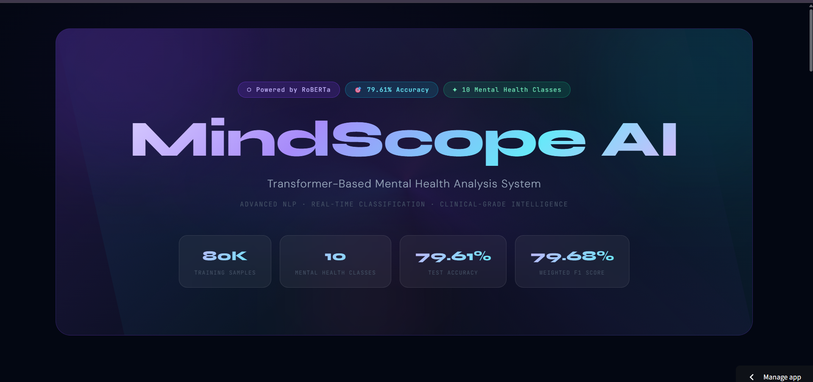
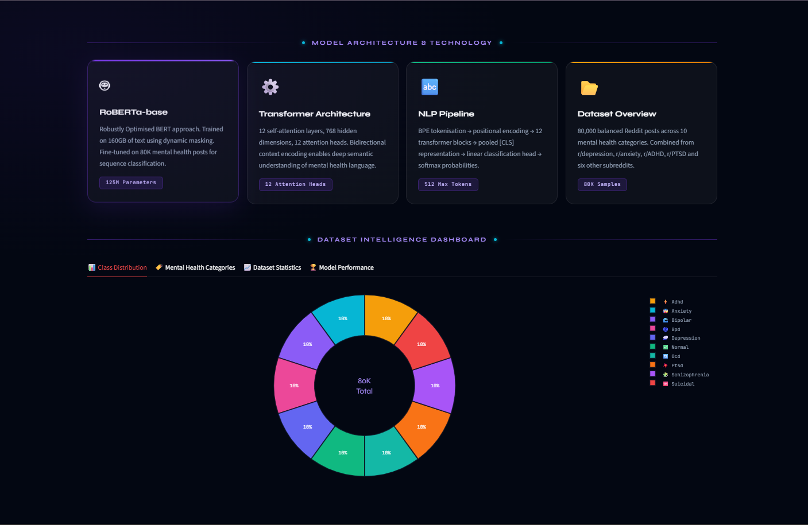
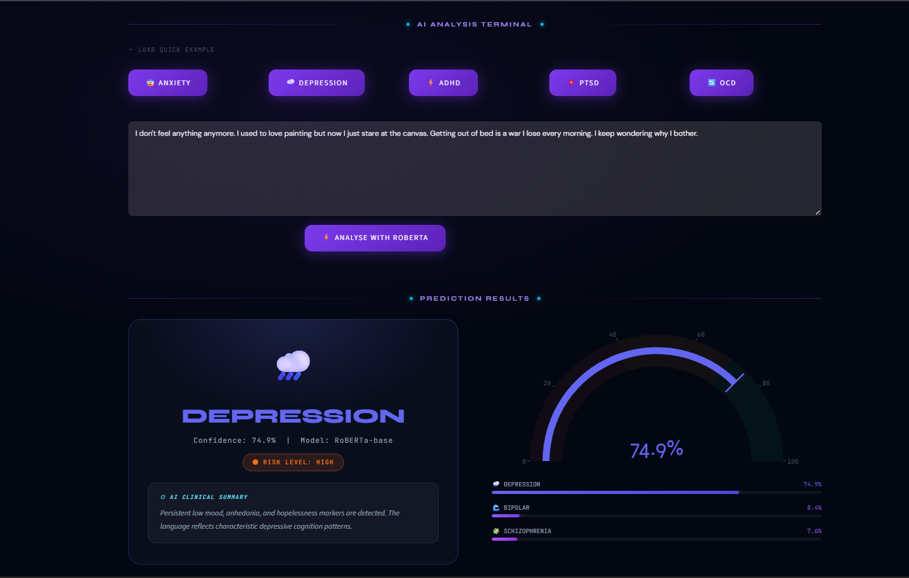
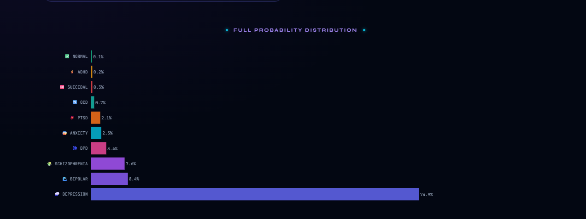
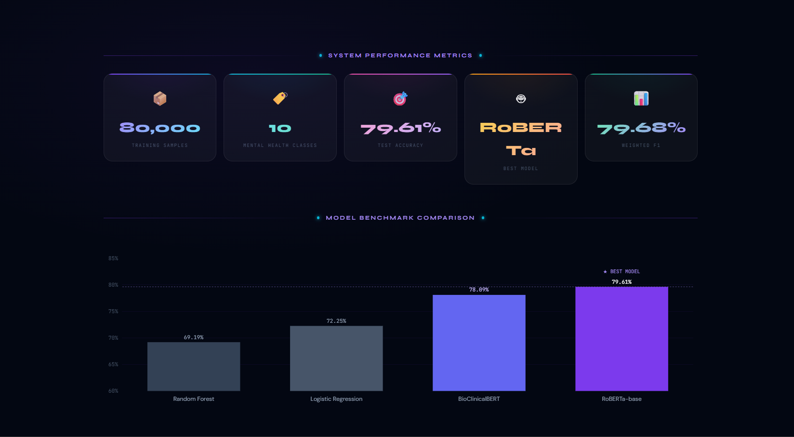

# 🧠 MindScope AI – Mental Health Crisis Predictor

An AI-powered web application that detects potential mental health conditions from user-written text using a fine-tuned **RoBERTa** transformer model.

The application analyzes text and predicts one of several mental health categories, providing confidence scores for each prediction through an interactive Streamlit interface.

🔗 **Live Demo:** https://mindscope-ai-ids.streamlit.app/

---

## 🚀 Features

- 🧠 Mental health text classification using RoBERTa
- 🌐 Interactive Streamlit web application
- 📊 Displays prediction confidence probabilities
- ⚡ Loads the trained model directly from Hugging Face
- 🔄 Real-time text analysis
- 📈 Includes data analysis and visualizations
- 📝 Jupyter notebook for model training

---

## 🧠 Supported Categories

The model predicts among the following mental health classes:

- Anxiety
- Depression
- Bipolar Disorder
- Borderline Personality Disorder (BPD)
- Schizophrenia
- Obsessive Compulsive Disorder (OCD)
- ADHD
- PTSD
- Normal

---

## 🏗️ Project Structure

```
MindScope-AI/
│
├── assets/                 # Application screenshots
├── model/
│   └── roberta_model/
│       ├── config.json
│       ├── tokenizer.json
│       ├── tokenizer_config.json
│       └── label_encoder.pkl
│
├── notebooks/
│   └── training.ipynb
│
├── results/
│   ├── plot1_label_distribution.png
│   ├── plot2_post_length.png
│   ├── plot3_wordcloud.png
│   ├── plot4_top_words.png
│   └── plot5_avg_length.png
│
├── webApp_v2.py
├── requirements.txt
└── README.md
```

---

## ⚙️ Technologies Used

- Python
- Streamlit
- Hugging Face Transformers
- RoBERTa
- PyTorch
- Scikit-learn
- Pandas
- NumPy
- Matplotlib
- WordCloud

---

## 📊 Model Information

**Model:** RoBERTa (Fine-tuned)

The model was trained on multiple publicly available mental health datasets containing social media posts related to various psychological conditions.

After preprocessing, balancing, and training, the model was deployed using:

- Hugging Face Model Hub
- Streamlit Cloud

The application downloads the trained model directly from Hugging Face at runtime, allowing the GitHub repository to remain lightweight.

---

## 📈 Data Analysis

The project also includes exploratory data analysis with visualizations such as:

- Label distribution
- Average post length
- Word cloud
- Most frequent words
- Dataset statistics

These are available in the **results/** folder.

---

## 📷 Application Preview

### 🏠 Home Page



---

### 📊 Model Architecture & Dashboard



---

### 🎯 Prediction Result



---

### 📈 Probability Distribution



---

### 🤖 Model Comparison



---

## 💻 Installation

Clone the repository:

```bash
git clone https://github.com/khadzzz4545-ctrl/mindscope-ai.git
```

Install dependencies:

```bash
pip install -r requirements.txt
```

Run the application:

```bash
streamlit run webApp_v2.py
```

---

## 🌐 Live Demo

https://mindscope-ai-ids.streamlit.app/

---

## 📚 Future Improvements

- Multi-label prediction support
- Explainable AI (SHAP/LIME)
- User authentication
- Prediction history
- PDF report generation
- REST API deployment
- Mobile-friendly interface

---

## 👩‍💻 Author

**Khadija Malik**

- GitHub: https://github.com/khadzzz4545-ctrl
- LinkedIn:https://www.linkedin.com/in/khadija-malik-80b422374/

---

⭐ If you found this project interesting, consider giving it a star!